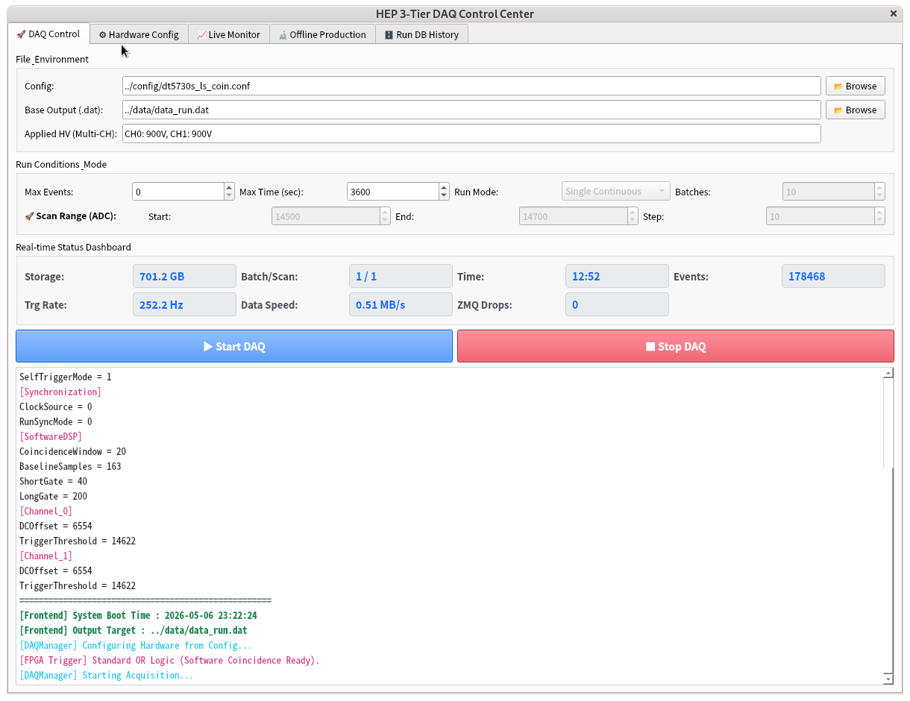
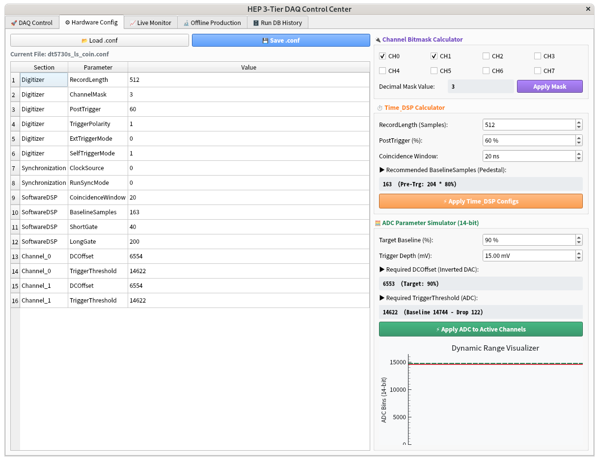
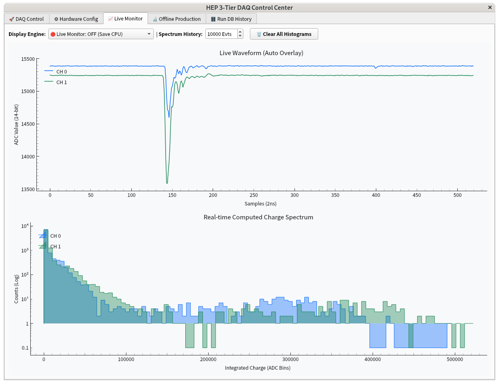
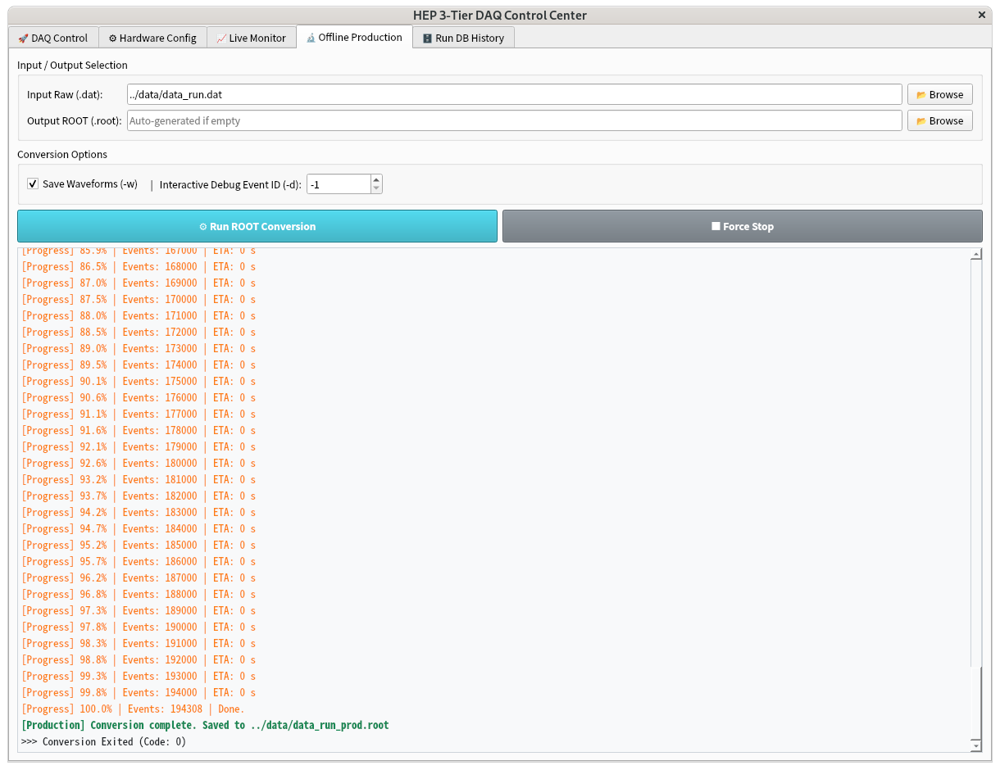
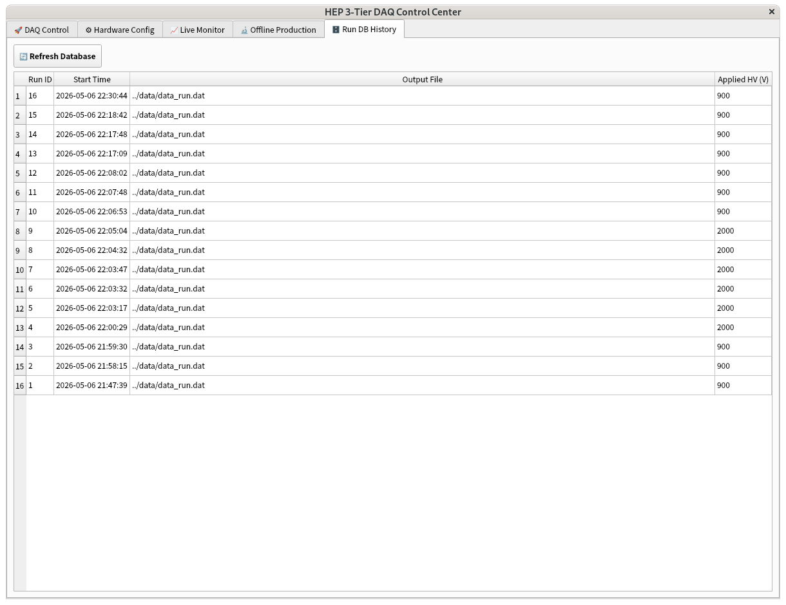

# HEP 3-Tier DAQ Control Center for CAEN DT5730S


본 프로젝트는 입자 및 핵물리 실험(고분해능 무기/유기 섬광체 등)을 위한 **CAEN DT5730S 디지타이저 기반의 하이브리드 데이터 수집(DAQ) 시스템**입니다. 

기존 일체형(Monolithic) DAQ 소프트웨어가 가지는 UI 렌더링 병목 현상과 메모리 누수 문제를 원천 차단하기 위해, **데이터 생산(C++)과 소비(Python)를 물리적으로 완벽히 분리(Decoupling)한 3-Tier 아키텍처**로 설계되었습니다. 

최신 업데이트를 통해 다중 채널 비트마스크 파싱, SQLite 기반 측정 이력 영구 보존, 동적 HTML 색상 로그, 그리고 유료 펌웨어 없이도 완벽한 시간차 동시 계수를 지원하는 **제1원리 소프트웨어 DSP(Software Coincidence DSP)** 프레임워크가 결합되어 상용(Commercial) 프로덕션 레벨의 완성도를 제공합니다.

```text
CPNR_dt5730s/
├── CMakeLists.txt              # C++ 백엔드(Tier 1 & 2) 빌드 설정 파일
├── README.md                   # 프로젝트 개요 및 빌드/실행 가이드 (최종 마스터판)
│
├── config/                     # [환경 설정] 장비 및 DAQ 파라미터 
│   ├── dt5730s_inorganic.conf  # 무기/유기 섬광체용 마스터 설정 파일
│   └── test.conf               # 테스트용 설정 파일
│
├── include/                    # [C++ 헤더] 공용 자료구조 및 래퍼
│   ├── CaenDigitizer.h         # CAEN 라이브러리 연동 헤더
│   ├── ConfigParser.h          # .conf 파일 파싱 유틸리티
│   ├── DAQManager.h            # 객체 지향 프론트엔드 코어 클래스 헤더
│   └── EventHeader.h           # 24 Bytes 초경량 공통 헤더 구조체 (TTT 롤오버 포함)
│
├── src/                        # [Tier 1 & 2] 초고속 C++ 데이터 수집 및 오프라인 생산 엔진
│   ├── DAQManager.cpp          # (Tier 1) 하드웨어 제어, ZMQ 스트리밍, 이진 기록 코어
│   ├── frontend_dt5730.cpp     # (Tier 1) 프론트엔드 독립 실행 메인 프로그램
│   └── production_dt5730.cpp   # (Tier 2) 이진 데이터 ROOT 변환 및 Micro-Time(T0) 추출기
│
├── gui/                        # [Tier 3] Python PyQt5 엣지 컴퓨팅 기반 제어 센터
│   ├── main.py                 # GUI 어플리케이션 진입점 (Entry Point)
│   ├── core/                   # GUI 백그라운드 엔진
│   │   ├── DatabaseManager.py  # SQLite DB 관리 (런 히스토리 및 .conf 스냅샷 영구 보존)
│   │   └── ProcessManager.py   # C++ 백엔드 QThread 워커 구동 및 터미널 출력 가로채기
│   ├── windows/                # 창 레이아웃 관리
│   │   └── MainWindow.py       # 메인 윈도우 프레임 
│   └── widgets/                # 5개의 핵심 사용자 경험(UX) 탭
│       ├── DaqTab.py           # 🚀 DAQ Control (실시간 대시보드, 연속/스캔 배치 모드)
│       ├── ConfigTab.py        # ⚙️ Hardware Config (마스터 아키텍트 파라미터 계산기)
│       ├── MonitorTab.py       # 📈 Live Monitor (다중 채널 자동 감지 오버레이 스펙트럼)
│       ├── ProductionTab.py    # 🔬 Offline Production (ROOT 변환 제어 및 디버깅)
│       └── DatabaseTab.py      # 🗄️ Run DB History (측정 이력 및 스냅샷 조회)
│
└── python_tools/               # [보조 도구] 독립 실행형 유틸리티
    └── monitoring_dt5730.py    # X-Server 환경 없이 터미널에서 구동 가능한 CLI 라이브 모니터
```

**[아키텍처 요약]**
*   `src/` 디렉토리의 파일들은 최대한 가볍고 빠르게 장비의 데이터를 디스크로 밀어내고 ZMQ로 쏘는 역할만 수행합니다 (C++의 강력함 활용)
*   `gui/` 디렉토리의 파일들은 ZMQ 패킷을 받아 실시간으로 전하량을 적분하고, 데이터베이스를 관리하며, 사용자와 상호작용하는 무거운 연산을 전담합니다 (Python의 유연함 활용)
---

## 📸 User Interface & Experience

### 1. DAQ Control & Real-time Dashboard

> 모던 라이트 테마(Light Theme)가 적용된 2단 대시보드. 실시간 데이터 전송 속도(MB/s), 트리거 Rate, DB 기록 상태, 디스크 잔여 용량을 한눈에 모니터링하며, 연속 구동 및 자동 임계값 스캔을 제어합니다.

### 2. Hardware Config & Master Architect Calculator

> 장비 조준경(DCOffset, Threshold 등)을 표에서 즉시 편집합니다. 16-bit 역방향 DAC 오프셋, 14-bit ADC 트리거 깊이, 그리고 가변 레코드 길이에 따른 최적의 페데스탈(Baseline) 샘플 수를 마우스만으로 역산출하여 `.conf`에 주입하는 궁극의 시뮬레이터가 탑재되어 있습니다.

### 3. Live Monitor (Auto Multi-Channel Overlay)

> 사용자가 타겟 채널을 고를 필요 없이, 켜져 있는 모든 채널을 자동 감지하여 파형(Waveform)과 에너지 스펙트럼(Q-Long)을 각기 다른 색상으로 한 캔버스에 투명하게 오버레이(Overlay) 합니다. 최대 누적 이벤트 수를 동적으로 조절하여 시인성을 확보합니다.

### 4. Offline Production (Micro-Time Extraction)

> 이진 데이터(`.dat`)의 ROOT 변환을 전담합니다. 변환 예상 시간(ETA) 출력 기능과 함께, 파형 내부의 정밀 펄스 시작 시간(T0) 추출 기능, 파형 강제 저장(-w) 옵션, 그리고 특정 이벤트를 팝업으로 띄우는 하드코어 디버깅(-d) 모드를 지원합니다.

### 5. Run DB History

> SQLite 데이터베이스에 기록된 과거 측정 이력 리스트업. 당시 장비에 인가된 다중 채널 고전압(HV) 값과 `.conf` 설정 파일의 전체 스냅샷을 영구 보존하고 추적합니다.
> 
---

## 🏛️ System Architecture 

시스템은 역할에 따라 세 가지 계층으로 완전히 분리되어 작동합니다.

1. **Tier 1: High-Speed Frontend (C++)**
   * **역할:** 하드웨어 제어 및 Raw 데이터 초고속 기록.
   * **특징:** 무거운 소프트웨어 DSP 연산을 배제하고 **24 Bytes 초경량 헤더**와 순수 파형(Waveform)만 디스크(`.dat`)에 기록하여 USB 대역폭과 디스크 I/O를 극대화합니다. 실시간 전송 속도(MB/s)를 자체 연산합니다.
   * **통신:** 수집된 데이터는 비동기 논블로킹(Non-blocking) 방식의 **ZeroMQ (PUB/SUB)** 소켓을 통해 브로드캐스팅됩니다. GUI의 상태와 무관하게 수집 프로세스는 절대 지연되지 않습니다.

2. **Tier 2: Offline Production (C++ & ROOT)**
   * **역할:** 이진 데이터(`.dat`)를 물리 분석용 ROOT 형식(`.root`)으로 고속 변환.
   * **특징:** 파일 포인터 점프(fseek) 기법을 활용해 파형 저장이 불필요할 경우 변환 속도를 10배 이상 끌어올렸으며, 특정 이벤트의 아날로그 파형을 즉각적으로 확인할 수 있는 **Interactive Debugging Mode (`-d`)**를 네이티브 지원합니다.

3. **Tier 3: Control Center GUI (Python PyQt5)**
   * **역할:** 실험 환경의 직관적인 제어 및 엣지 컴퓨팅(Edge Computing) 기반의 실시간 모니터링.
   * **특징:** C++ 프론트엔드를 QThread 워커로 구동하여 표준 출력을 낚아채고(Stream Routing), 데이터를 분기하여 2단 대시보드 메트릭과 시인성 높은 **HTML 기반 동적 컬러 로그**를 렌더링합니다.

---

## ✨ Key Features

* **Software Coincidence DSP (Micro-Time Extraction):** 장비의 표준 펌웨어가 가지는 하드웨어 로직의 한계를 극복하기 위해, 오프라인 변환기(Tier 2)가 파형 내부에서 펄스가 하강을 시작한 **정밀 상대 시간(T0, Micro-Time)**을 ns 단위로 자동 추출합니다. 이를 통해 ROOT 상에서 완벽한 20ns 윈도우 동시 계수 필터링을 지원합니다.
* **Automated Threshold Scan Engine:** 단일 광자(Single Photon) 캘리브레이션 및 노이즈 플로어 탐색을 위해, 지정된 스텝(Step) 크기만큼 하드웨어 임계값을 실시간으로 변화시키며 무한 루프를 도는 자동 획득 제어 기능을 탑재했습니다. (`_th14500.dat` 형식으로 분할 저장)
* **Auto Multi-Channel Edge Computing Monitor:** Python 워커 스레드가 수신된 ZMQ 패킷의 `ChannelMask`를 실시간으로 역산출하여, 켜져 있는 모든 채널을 자동으로 감지하고 다중 오버레이(Multi-Overlay) 스펙트럼 적분을 수행합니다.
* **Continuous / Batch Mode:** 단일 구동뿐만 아니라, 지정된 이벤트 수(-n)나 시간(-t) 단위로 파일 번호를 자동 증가(`_part01`)시키며 분할 저장하는 무한 백그라운드 배치 모드를 지원합니다.
* **SQLite Run Database:** DAQ가 구동될 때마다 Run ID, 측정 일시, 출력 파일명, 사용자가 텍스트로 자유롭게 기입한 다중 채널 고전압(HV) 값, 그리고 **당시 장비에 인가된 `.conf` 설정 파일의 전체 스냅샷**을 `run_history.db`에 영구 기록 및 추적합니다.

---

## ⚙️ Prerequisites

* **OS:** Linux (Rocky Linux 8/9, CentOS 7, Ubuntu 20.04+ recommended)
* **CAEN Libraries & Drivers (필수 설치):**
  * `CAENUSB` (USB 커널 드라이버)
  * `CAENVME` (CAENVMELib)
  * `CAENComm`
  * `CAENDigitizer` (v1.0 버전)
  > ⚠️ **[주의] 커널(Kernel) 업데이트 관련:** Linux OS의 커널 버전이 업데이트될 경우, 기존에 빌드된 `CAENUSB` 커널 모듈(드라이버)의 종속성이 끊어져 장치를 인식하지 못합니다. **OS 커널 업데이트 직후에는 반드시 `CAENUSB` 소스 디렉토리로 이동하여 설치 스크립트(예: `sudo sh install` 을 이용한 DKMS 빌드)를 재실행**해야 합니다.
  > 신형 장비 경우 `libusb-1.0` 라이브러리를 이용함에 따라 커널 모듈 종속성에 대하여 유연하게 대처할 수 있습니다. 
* **Data Libraries:** 
  * ROOT 6 (built with C++17 지원 플래그)
  * ZeroMQ (`libzmq3-dev`)
* **Python Libraries:** 
  * `PyQt5`, `pyqtgraph`, `numpy`, `pyzmq`

---

## 🚀 Build & Installation

CMake를 활용하여 C++ 백엔드를 빌드함과 동시에, GUI 구동을 위한 Python 모듈들이 `bin/` 디렉토리로 자동 배포(Deployment)됩니다.

```bash
git clone [https://github.com/opercjy/CPNR_dt5730s.git](https://github.com/opercjy/CPNR_dt5730s.git)
cd CPNR_dt5730s
mkdir build && cd build
cmake ..
make -j4
```

---

## 🖥️ Usage

빌드가 완료되면 생성된 래퍼 스크립트를 통해 GUI를 즉시 실행할 수 있습니다. (작업 디렉토리가 자동으로 `bin/`으로 고정됩니다.)
```bash
./bin/daq_gui
```

**가벼운 CLI 모니터링 단독 실행 (X-Server 불필요):**
메인 프로그램을 띄우지 않고 터미널 환경에서 가볍게 다중 채널 파형과 스펙트럼만 모니터링할 경우 아래 스크립트를 실행합니다.
./bin/frontend_dt5730 실행시
```bash
./python_tools/monitoring_dt5730.py
```

### GUI 탭(Tab)별 기능 명세서
* **🚀 DAQ Control:** 파일 브라우저 연동, 인가 전압(HV) 문자열 기입, 런 조건(Events/Time) 및 분할/스캔(Scan) 배치 모드 설정. 모던 라이트 테마 기반의 2단 실시간 대시보드(Storage, Hz, MB/s, ZMQ Drops 등) 및 컬러 파싱 터미널 창 제공.
* **⚙️ Hardware Config:** 장비 조준경(DCOffset, Threshold, RecordLength 등)을 GUI 상의 표(TableWidget)에서 즉시 편집하고 `.conf`에 반영(Single Source of Truth). **Time & DSP / ADC Simulator**를 통한 제1원리 파라미터 자동 산출.
* **📈 Live Monitor:** ZMQ 소켓 실시간 파형(Waveform) 모니터링 및 에너지 전하량(Q-Long) 동적 적분 스펙트럼. 활성 채널 자동 감지 오버레이 및 누적 히스토리 사이즈 조절 지원.
* **🔬 Offline Production:** `.dat` -> `.root` 변환 전담. Micro-Time(T0) 추출, 파형 강제 저장(-w) 옵션, 변환 시간(ETA) 출력 기능 및 특정 Event ID 하드코어 팝업 디버깅(-d).
* **🗄️ Run DB History:** SQLite 데이터베이스에 기록된 과거 측정 이력 리스트업 및 당시 `.conf` 파일 스냅샷 추적.

---

## 👨‍🔬 Author & Acknowledgment

* **Ji-young Choi (최지영)** 
  * Nuclear and Particle Physicist
  * Department of Physics, Center for Precision Neutrino Research (CPNR), Chonnam National University

> **🙏 Funding & Open Source Statement**
> 
> 본 연구 및 소프트웨어 개발은 **국민의 소중한 세금으로 조성된 국가 연구개발(R&D) 재원**을 바탕으로 수행되었습니다. 
> 
> 기초 과학 연구를 위해 기꺼이 세금을 부담해 주신 대한민국 국민 여러분께 깊은 감사를 드립니다. 그 헌신에 조금이나마 보답하고 공공의 이익에 기여하고자, 본 프로젝트에서 개발된 데이터 획득(DAQ) 소스코드와 제1원리 기반의 분석 방법론은 상업적 독점이나 파편화를 철저히 배제하고 오픈소스 원칙에 따라 투명하게 전체 공개됩니다. 
> 이 코드가 예산이 부족한 기초과학 연구실이나 훌륭한 후학들의 실험 인프라 구축에 작은 디딤돌이 되기를 진심으로 바랍니다.
