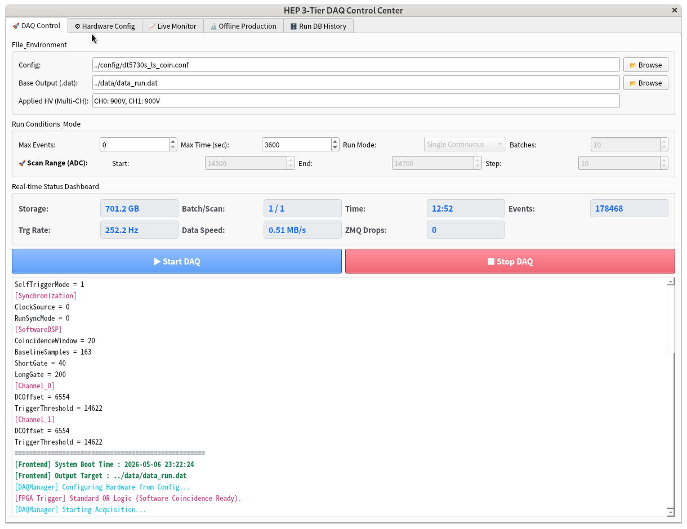
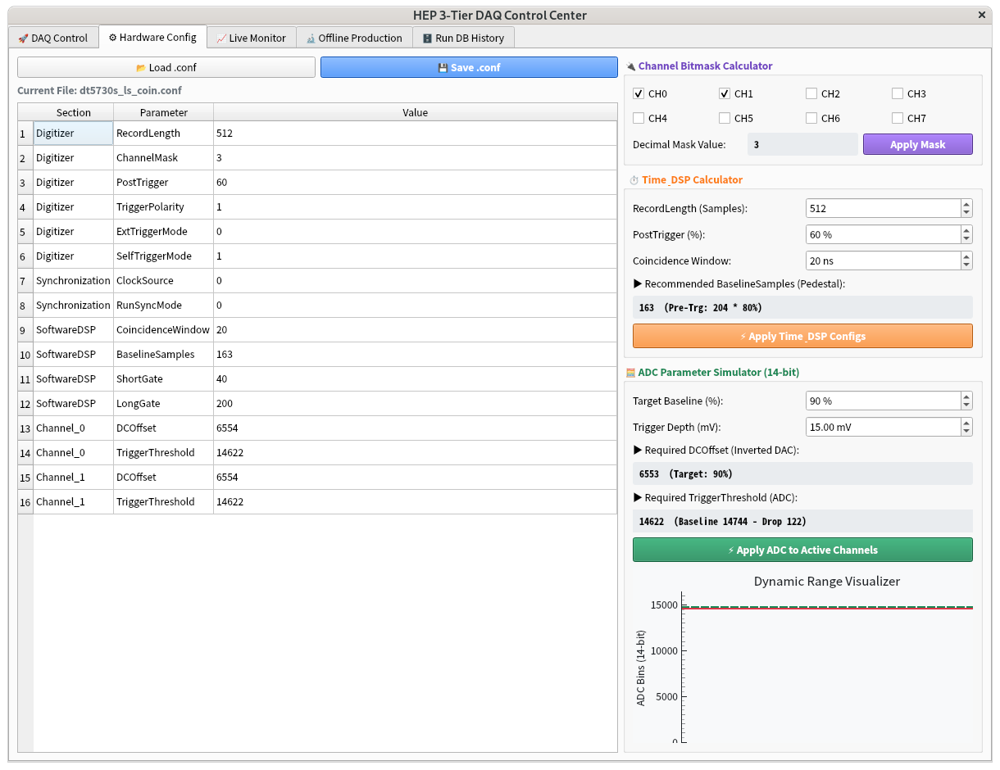
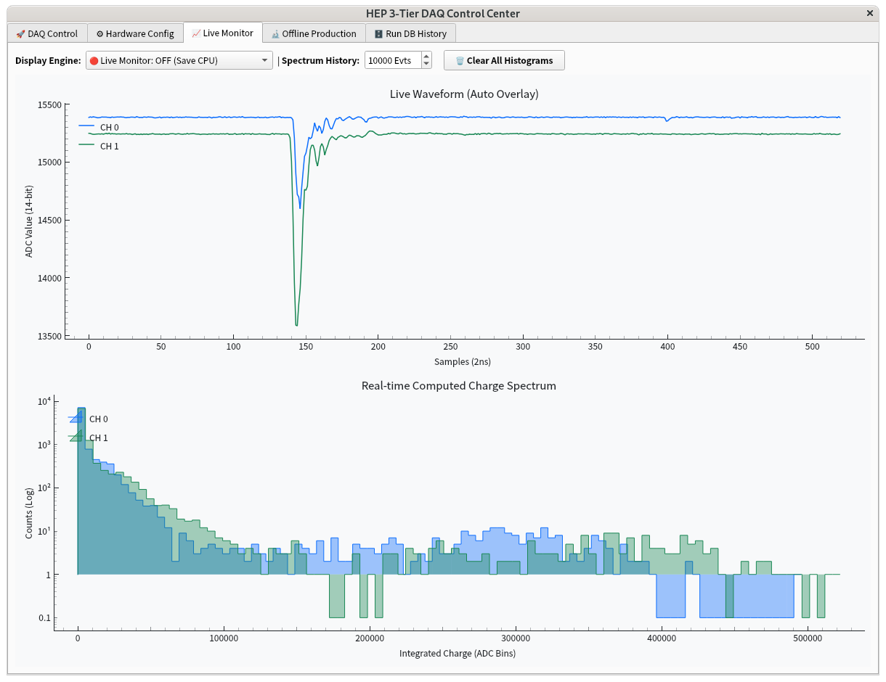
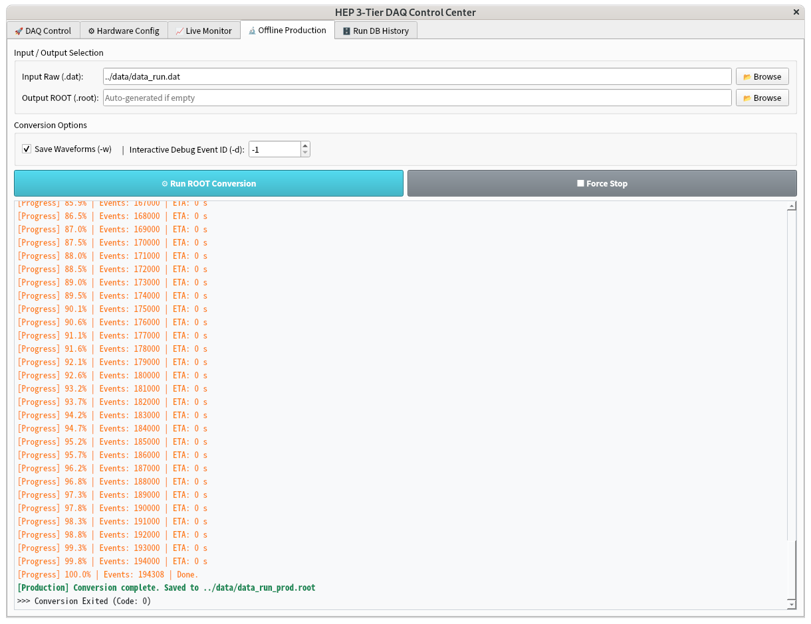
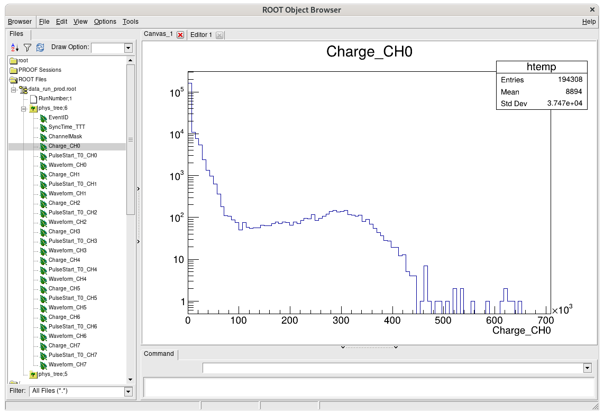
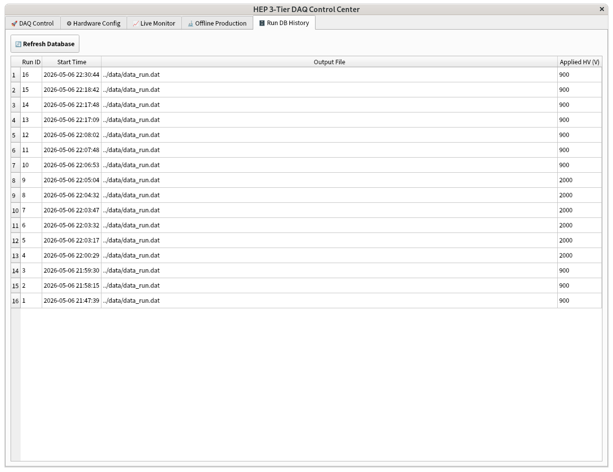

# HEP 3-Tier DAQ Control Center for CAEN DT5730S


본 프로젝트는 입자 및 핵물리 실험(고분해능 무기/유기 섬광체 등)을 위한 **CAEN DT5730S 디지타이저 기반의 하이브리드 데이터 수집(DAQ) 시스템**입니다. 

기존 일체형(Monolithic) DAQ 소프트웨어가 가지는 UI 렌더링 병목 현상과 메모리 누수 문제를 원천 차단하기 위해, **데이터 생산(C++)과 소비(Python)를 물리적으로 완벽히 분리(Decoupling)한 3-Tier 아키텍처**로 설계되었습니다. 

최신 업데이트를 통해 기록 채널과 self-trigger 참여 채널을 독립적으로 선택할 수 있으며, DT5730S의 인접 채널 pair에 AND/OR 논리를 적용할 수 있습니다. SQLite 기반 측정 이력, 동적 HTML 로그 및 오프라인 시간차 동시 계수 분석도 함께 제공합니다.

```text
CPNR_dt5730s/
├── CMakeLists.txt              # C++ 백엔드(Tier 1 & 2) 빌드 설정 파일
├── README.md                   # 프로젝트 개요 및 빌드/실행 가이드 (최종 마스터판)
│
├── config/                     # [환경 설정] 장비 및 DAQ 파라미터 
│   ├── dt5730s_master.conf     # CH0/1 AND, CH0~3 기록 예제
│   ├── dt5730s_inorganic.conf  # 무기 섬광체용 설정 파일
│   ├── dt5730s_ls_coin.conf    # 액체 섬광체 CH0/1 coincidence 예제
│   ├── dt5730s_ext_clock.conf  # 외부 클록/트리거 전용 예제
│   └── test.conf               # 테스트용 설정 파일
│
├── include/                    # [C++ 헤더] 공용 자료구조 및 래퍼
│   ├── CaenDigitizer.h         # CAEN 라이브러리 연동 헤더
│   ├── ConfigParser.h          # .conf 파일 파싱 유틸리티
│   ├── DAQManager.h            # 객체 지향 프론트엔드 코어 클래스 헤더
│   └── EventHeader.h           # 24 Bytes 초경량 공통 헤더 구조체 (TTT 롤오버 포함)
│
├── src/                        # [Tier 1 & 2] 초고속 C++ 데이터 수집 및 오프라인 생산 엔진
│   ├── DAQManager.cpp          # (Tier 1) 하드웨어 제어, ZMQ 스트리밍, 이진 기록 코어
│   ├── frontend_dt5730.cpp     # (Tier 1) 프론트엔드 독립 실행 메인 프로그램
│   ├── raw_salvage_dt5730.cpp  # 실패 run의 읽기 전용 .partial prefix 복구 도구
│   ├── production_dt5730.cpp   # (Tier 2) 이진 데이터 ROOT 변환 및 Micro-Time(T0) 추출기
│   └── RootValidator.cpp       # production ROOT 무결성/threshold/provenance 검증기
│
├── gui/                        # [Tier 3] Python PyQt6 엣지 컴퓨팅 기반 제어 센터
│   ├── main.py                 # GUI 어플리케이션 진입점 (Entry Point)
│   ├── core/                   # GUI 백그라운드 엔진
│   │   ├── DatabaseManager.py  # SQLite DB 관리 (런 히스토리 및 .conf 스냅샷 영구 보존)
│   │   └── ProcessManager.py   # C++ 백엔드 QThread 워커 구동 및 터미널 출력 가로채기
│   ├── windows/                # 창 레이아웃 관리
│   │   └── MainWindow.py       # 메인 윈도우 프레임 
│   └── widgets/                # 6개의 핵심 사용자 경험(UX) 탭
│       ├── DaqTab.py           # 🚀 DAQ Control (실시간 대시보드, 연속/스캔 배치 모드)
│       ├── ConfigTab.py        # ⚙️ Hardware Config (마스터 아키텍트 파라미터 계산기)
│       ├── MonitorTab.py       # 📈 Live Monitor (다중 채널 자동 감지 오버레이 스펙트럼)
│       ├── ProductionTab.py    # 🔬 Offline Production (ROOT 변환 제어 및 디버깅)
│       ├── RootValidationTab.py # ✅ ROOT Validation (읽기 전용 전수 검증)
│       └── DatabaseTab.py      # 🗄️ Run DB History (측정 이력 및 스냅샷 조회)
│
└── python_tools/               # [보조 도구] 독립 실행형 유틸리티
    └── monitoring_dt5730.py    # X-Server 환경 없이 터미널에서 구동 가능한 CLI 라이브 모니터
```

**[아키텍처 요약]**
*   `src/` 디렉토리의 파일들은 최대한 가볍고 빠르게 장비의 데이터를 디스크로 밀어내고 ZMQ로 쏘는 역할만 수행합니다 (C++의 강력함 활용)
*   `gui/` 디렉토리의 파일들은 ZMQ 패킷을 받아 실시간으로 전하량을 적분하고, 데이터베이스를 관리하며, 사용자와 상호작용하는 무거운 연산을 전담합니다 (Python의 유연함 활용)
---

## 📸 User Interface & Experience

### 1. DAQ Control & Real-time Dashboard

> 모던 라이트 테마(Light Theme)가 적용된 2단 대시보드. 실시간 데이터 전송 속도(MB/s), 트리거 Rate, DB 기록 상태, 디스크 잔여 용량을 한눈에 모니터링하며, 연속 구동 및 자동 임계값 스캔을 제어합니다.

### 2. Hardware Config & Master Architect Calculator

> DC offset은 채널별 목표 baseline 위치(%)로 지정할 수 있고 raw 16-bit DAC code는 고급 호환 모드로 남아 있습니다. mV threshold는 이론 baseline으로 absolute ADC 값을 만들지 않고 `.conf`에 요청값으로 저장되며, frontend가 DC-offset 자동 조정·settling 뒤 software-trigger 파형에서 채널별 baseline을 측정해 실제 discriminator 값을 계산하고 readback합니다.

### 3. Live Monitor (Auto Multi-Channel Overlay)

> 사용자가 타겟 채널을 고를 필요 없이, 켜져 있는 모든 채널을 자동 감지하여 파형(Waveform)과 baseline-subtracted full-waveform signed charge 스펙트럼을 각기 다른 색상으로 한 캔버스에 투명하게 오버레이(Overlay) 합니다. 기본 100,000개 또는 명시적 Unlimited 누적 history를 선택할 수 있습니다.

### 4. Offline Production (Micro-Time Extraction)


> 이진 데이터(`.dat`)의 ROOT 변환을 전담합니다. 변환 예상 시간(ETA) 출력 기능과 함께, schema 3에서는 polarity-corrected peak 시각을 T0로 기록하고, 파형 강제 저장(-w) 옵션과 특정 이벤트를 팝업으로 띄우는 하드코어 디버깅(-d) 모드를 지원합니다.

### 5. Production ROOT Validation
> ROOT 구조와 branch type, EventID/TTT 연속성, event mask/record length, summary 통계, 채널별 finite/range/sentinel, baseline 안정화, threshold 실효값, AND/OR routing 증거를 읽기 전용으로 검사합니다. 최신 파일은 내장 config/metadata와 SHA-256까지 대조하며, 구형 파일은 데이터 무결성과 추적 불가(provenance)를 분리해 표시합니다.

### 6. Run DB History

> SQLite 데이터베이스에 기록된 과거 측정 이력 리스트업. 당시 장비에 인가된 다중 채널 고전압(HV) 값과 `.conf` 설정 파일의 전체 스냅샷을 영구 보존하고 추적합니다.
> 
---

## 🏛️ System Architecture 

시스템은 역할에 따라 세 가지 계층으로 완전히 분리되어 작동합니다.

1. **Tier 1: High-Speed Frontend (C++)**
   * **역할:** 하드웨어 제어 및 Raw 데이터 초고속 기록.
   * **특징:** 무거운 소프트웨어 DSP 연산을 배제하고 **24 Bytes 초경량 헤더**와 순수 파형(Waveform)만 디스크(`.dat`)에 기록하여 USB 대역폭과 디스크 I/O를 극대화합니다. 실시간 전송 속도(MB/s)를 자체 연산합니다.
   * **통신:** 수집된 데이터는 비동기 논블로킹(Non-blocking) 방식의 **ZeroMQ (PUB/SUB)** 소켓을 통해 브로드캐스팅됩니다. GUI의 상태와 무관하게 수집 프로세스는 절대 지연되지 않습니다.

2. **Tier 2: Offline Production (C++ & ROOT)**
   * **역할:** 이진 데이터(`.dat`)를 물리 분석용 ROOT 형식(`.root`)으로 고속 변환.
   * **특징:** 파일 포인터 점프(fseek) 기법을 활용해 파형 저장이 불필요할 경우 변환 속도를 10배 이상 끌어올렸으며, 특정 이벤트의 아날로그 파형을 즉각적으로 확인할 수 있는 **Interactive Debugging Mode (`-d`)**를 네이티브 지원합니다.

3. **Tier 3: Control Center GUI (Python PyQt6)**
   * **역할:** 실험 환경의 직관적인 제어 및 엣지 컴퓨팅(Edge Computing) 기반의 실시간 모니터링.
   * **특징:** C++ 프론트엔드를 QThread 워커로 구동하여 표준 출력을 낚아채고(Stream Routing), 데이터를 분기하여 2단 대시보드 메트릭과 시인성 높은 **HTML 기반 동적 컬러 로그**를 렌더링합니다.

---

## ✨ Key Features

* **Software Coincidence DSP (Micro-Time Extraction):** 오프라인 변환기(Tier 2)가 polarity를 보정한 파형의 최대 높이 시각을 **정밀 상대 시간(T0, Micro-Time)**으로 ns 단위로 기록하여, ROOT 분석 단계에서 사용자가 정한 시간차 조건을 적용할 수 있습니다.
* **Automated Threshold Scan Engine:** 단일 광자(Single Photon) 캘리브레이션 및 노이즈 플로어 탐색을 위해, 지정된 스텝(Step) 크기만큼 하드웨어 임계값을 실시간으로 변화시키며 무한 루프를 도는 자동 획득 제어 기능을 탑재했습니다. (`_th14500.dat` 형식으로 분할 저장)
* **Auto Multi-Channel Edge Computing Monitor:** Python 워커 스레드가 수신된 ZMQ 패킷의 `ChannelMask`를 실시간으로 역산출하여, 켜져 있는 모든 채널을 자동으로 감지하고 다중 오버레이(Multi-Overlay) 스펙트럼 적분을 수행합니다.
* **Continuous / Batch Mode:** 단일 구동뿐만 아니라, 지정된 이벤트 수(-n)나 시간(-t) 단위로 파일 번호를 자동 증가(`_part01`)시키며 분할 저장하는 무한 백그라운드 배치 모드를 지원합니다.
* **SQLite Run Database:** DAQ가 구동될 때마다 Run ID, 측정 일시, 출력 파일명, 사용자가 텍스트로 자유롭게 기입한 다중 채널 고전압(HV) 값, 그리고 **당시 장비에 인가된 `.conf` 설정 파일의 전체 스냅샷**을 `run_history.db`에 영구 기록 및 추적합니다.

---

## ⚙️ Prerequisites

* **OS:** Linux (Rocky Linux 8/9, CentOS 7, Ubuntu 20.04+ recommended)
* **CAEN Libraries & Drivers (필수 설치):**
  * `CAENUSB` (USB 커널 드라이버)
  * `CAENVME` (CAENVMELib)
  * `CAENComm`
  * `CAENDigitizer` 2.17.0 이상
    (`Digitizer 1.0`은 장비/API 세대명이며 라이브러리 버전 1.0을 뜻하지 않습니다.)
  > ⚠️ **[주의] 커널(Kernel) 업데이트 관련:** Linux OS의 커널 버전이 업데이트될 경우, 기존에 빌드된 `CAENUSB` 커널 모듈(드라이버)의 종속성이 끊어져 장치를 인식하지 못합니다. **OS 커널 업데이트 직후에는 반드시 `CAENUSB` 소스 디렉토리로 이동하여 설치 스크립트(예: `sudo sh install` 을 이용한 DKMS 빌드)를 재실행**해야 합니다.
  > 신형 장비 경우 `libusb-1.0` 라이브러리를 이용함에 따라 커널 모듈 종속성에 대하여 유연하게 대처할 수 있습니다. 
* **Data Libraries:** 
  * ROOT 6 (built with C++17 지원 플래그)
  * libusb 1.0 (`libusb-1.0-0-dev`)
  * ZeroMQ (`libzmq3-dev`)
  * Qt/X11 runtime (`libxcb-cursor0`, Ubuntu 24.04의 PyQt6 xcb 플러그인에 필요)
* **Python Libraries:** 
  * `PyQt6`, `pyqtgraph`, `numpy`, `pyzmq`

---

## 🚀 Build & Installation

CMake를 활용하여 C++ 백엔드를 빌드함과 동시에, GUI 구동을 위한 Python 모듈들이 `bin/` 디렉토리로 자동 배포(Deployment)됩니다.

Ubuntu의 X11 세션에서 PyQt6 GUI를 실행하려면 다음 런타임 패키지가 필요합니다.

```bash
sudo apt-get install libxcb-cursor0
```

```bash
git clone https://github.com/SWGwon/CPNR_dt5730s_MD.git
cd CPNR_dt5730s_MD
mkdir build && cd build
cmake ..
make -j4
```

프로젝트 루트 디렉토리에서, CAEN 라이브러리를 시스템 전역이 아닌 별도 prefix에
설치했다면 해당 경로를
명시합니다. 이 prefix에는 `include/CAENDigitizer.h`와 `lib/` 또는 `lib64/`의
`libCAENDigitizer`, `libCAENComm`, `libCAENVME`가 있어야 합니다.

```bash
PKG_CONFIG_PATH="$PWD/build/local/lib/pkgconfig" \
cmake -S . -B build \
  -DCMAKE_PREFIX_PATH="$PWD/build/local" \
  -DCAEN_ROOT="$PWD/build/local"
cmake --build build -j4
```

GUI 의존성은 시스템 Python과 섞지 않고 프로젝트 venv에 설치할 수 있습니다.
`bin/daq_gui`는 `build/venv`가 있으면 자동으로 이 Python을 사용합니다.

```bash
python3 -m venv build/venv
build/venv/bin/python -m pip install -r requirements.txt
```

하드웨어 SDK나 ROOT/ZeroMQ 없이 설정 검증 회귀 테스트만 실행할 수도 있습니다.

```bash
cmake -S . -B build-test -DBUILD_DAQ_APPLICATIONS=OFF -DBUILD_TESTING=ON
cmake --build build-test
ctest --test-dir build-test --output-on-failure
```

DAQ 시작 전 설정 검증은 `RecordLength` 130–102400(10의 배수), 1개 이상의 활성 채널,
최소 160 ns의 pre-trigger 구간 및 활성 채널별 DAC/threshold 범위를 요구합니다.
검증에 실패하면 디지타이저를 열지 않고 실행을 중단합니다.

`[Connection]`의 `Link`, `Node`, `BaseAddress`, `ExpectedModel`로 연결 대상을 고정하며,
같은 모델이 여러 대 있거나 장비 교체를 엄격히 추적해야 할 때는 `ExpectedSerial`도
지정하십시오. Frontend는 장비를 연 뒤 model/serial/firmware/ADC family를 먼저
확인하고, 기대한 장비임이 입증된 경우에만 reset과 register write를 수행합니다.

### 기록 채널과 트리거 채널 설정

`ChannelMask`와 `SelfTriggerMask`는 8비트 값을 10진수로 적습니다. 비트 0부터 비트 7까지가 각각 CH0부터 CH7에 대응합니다.

- `ChannelMask`: 이벤트가 승인되었을 때 파형을 기록할 채널
- `SelfTriggerMask`: 입력 임계값 비교기가 self-trigger 생성에 참여할 채널. 기록하지 않는 채널은 선택할 수 없으므로 `ChannelMask`의 부분집합이어야 합니다.
- `PairLogic`: 고정 인접 pair에 적용할 `AND` 또는 `OR` 논리

새 마스크 방식을 사용할 때는 `SelfTriggerMask`와 `PairLogic`을 함께 설정해야 합니다. 두 항목을 모두 생략한 기존 설정은 이전 동작을 보존하기 위해 `ChannelMask`를 self-trigger 마스크로 사용하고 pair 레지스터를 직접 변경하지 않습니다. `[SoftwareDSP] CoincidenceWindow`는 저장된 이벤트를 오프라인에서 분석할 때 쓰는 별도 값이며 하드웨어 트리거 조건을 바꾸지 않습니다.

DT5730S x730 계열의 self-trigger 논리는 `(CH0, CH1)`, `(CH2, CH3)`, `(CH4, CH5)`, `(CH6, CH7)`의 고정 pair 구조를 사용합니다. `OR`에서는 선택한 채널 하나만 임계값을 넘어도 해당 pair가 트리거를 만들고, `AND`에서는 pair의 두 채널 threshold comparator 출력이 실제로 겹칠 때만 트리거를 만듭니다. 이는 고정된 ns 단위 coincidence window가 아니므로 신호 폭과 threshold에 따라 유효 겹침 시간이 달라집니다. `AND`를 사용할 때는 같은 pair의 두 비트를 모두 `SelfTriggerMask`에 포함해야 합니다. 여러 pair를 활성화하면 각 pair의 결과는 서로 OR로 결합됩니다. 이 레지스터 구성은 표준 waveform firmware에서만 적용되며, DPP firmware가 감지되면 잘못된 레지스터 쓰기를 막기 위해 DAQ 시작을 중단합니다. 설정한 레지스터는 시작 시 readback으로 확인하지만, DT5730S에 처음 적용할 때는 pulser로 CH0/CH1 단독 입력과 동시 입력을 각각 시험해 실제 trigger 동작도 확인하는 것을 권장합니다.

아래는 **CH0 AND CH1로 트리거하면서 CH0~CH3을 모두 기록**하는 설정입니다.

```ini
[Digitizer]
ChannelMask=15
SelfTriggerMask=3
ExtTriggerMode=0
SelfTriggerMode=1

[HardwareCoincidence]
PairLogic=AND
```

이 경우 CH2와 CH3의 임계값은 트리거 결정에 관여하지 않습니다. 다만 readout-only 채널도 연속으로 독립 기록되는 것은 아니며, CH0/CH1 coincidence로 global trigger가 승인될 때 같은 이벤트 시간 구간이 함께 저장됩니다.

### Measured baseline target and baseline-relative mV threshold

DT5730S의 waveform ADC와 discriminator code는 14-bit이지만 DC offset을 만드는 별도 DAC 제어값은 16-bit입니다. 이 DAC는 `0..65535`이고 값이 커질수록 ADC baseline은 내려갑니다. 명목상 90% baseline의 초기값은 `6554`이지만, DAC 범위가 ADC보다 약 5% 넓고 입력의 DC level 및 채널별 오차가 더해지므로 raw DAC code만으로 실제 baseline을 정확히 예측할 수 없습니다.

일반 사용자는 `TargetBaseline` 모드에서 파형 화면상의 목표 위치를 `5..95%`로 지정합니다. 음극성/falling pulse에는 90%, 양극성/rising pulse에는 10%가 일반적인 시작점입니다. frontend는 모든 trigger source를 끈 채 명목 DAC seed를 쓰고, DAC busy/readback과 analog settling을 확인한 다음 software-trigger 파형의 채널별 median을 측정해 목표까지 제한된 횟수로 조정합니다. 목표에 수렴하지 않으면 physics acquisition은 시작하지 않습니다.

```ini
[Digitizer]
InputRangeMv=2000
ADCBits=14
TriggerPolarity=1

[TriggerCalibration]
SettlingTimeMs=3000
SettlingTimeoutMs=15000
MeasurementEvents=32
StabilityToleranceAdc=2.0
StableMeasurements=3

[DCOffsetCalibration]
TargetTolerancePercent=0.5
MaxAdjustmentIterations=8
DacBusyTimeoutMs=1000
StepSettlingTimeMs=3000

[Channel_0]
DCOffsetMode=TargetBaseline
BaselineTargetPercent=90.0
TriggerThresholdMv=1.0
```

90%의 14-bit 목표값은 `round(0.9*16383) = 14745 ADC`입니다. 2 Vpp/14-bit에서는 1 LSB가 `2000/16384 = 0.1220703125 mV`이므로 1 mV는 반올림해 8 ADC입니다. Falling edge라면 frontend가 `round(measured_baseline[ch]) - 8`, rising edge라면 `+ 8`을 채널별로 기록합니다. 범위·최종 DAC·polarity·threshold 및 pair/global trigger register readback이 하나라도 요청값과 다르면 physics acquisition을 시작하지 않습니다.

기존 설정은 생략형 `DCOffset=<code>` 또는 명시적인 `DCOffsetMode=RawDac`와 `DCOffset=<code>`로 계속 재현할 수 있습니다. `DCOffset`과 `BaselineTargetPercent`를 동시에 쓰면 어느 값을 신뢰할지 모호하므로 거부합니다. RawDac 모드는 code를 그대로 write/readback할 뿐 목표 baseline으로 자동 보정하지 않습니다. 기존 `TriggerThreshold=<absolute ADC>`도 호환되지만 실측 baseline-relative threshold 보정은 적용되지 않습니다.

현재 production DSP schema 3은 `[SoftwareDSP] BaselineSamples`로 baseline을 구한 뒤
polarity를 보정한 파형에서 높이가 가장 큰 샘플을 찾습니다. `Charge_CH*`는 그 peak를
기준으로 **[-20 ns, +40 ns)**, 즉 2 ns/sample에서 `[peak-10, peak+20)` 구간을
파형 경계 안으로 잘라 signed 합한 값입니다. 양·음 성분을 모두 더해 노이즈가
상쇄되며 최종 음수 값도 0으로 자르지 않습니다. `ShortCharge_CH*`는 schema 3에서
`Charge_CH*`와 같은 값이고, `PulseStart_T0_CH*`에는 threshold crossing이 아니라
peak 시각이 기록됩니다.

`ShortGate`, `LongGate`, `PulseStartThresholdAdc`는 현재 schema 3의 charge 적분에는
사용하지 않습니다. 이 값들은 기존 schema 1/2 파일의 재현과 설정 provenance를 위해
계속 저장·검증되며, schema 1/2에서만 threshold 기준 고정 gate를 정의합니다.

GUI의 **Time & DSP Calculator**는 `RecordLength`를 x730의 10-sample 단위로 올림
정규화하고, 하드웨어 `PostTrigger` quantization readback을 예측한 뒤 그
pre/post 구간에 맞춰 `RecordLength`, `PostTrigger`, `BaselineSamples`,
`ShortGate`, `LongGate`를 함께 반영합니다. 여기서 gate 두 값은 schema 1/2 호환성과
provenance를 위한 legacy 설정이며 schema 3의 peak-centered window를 바꾸지 않습니다.

전면 패널 `TRG-IN`만 사용하는 외부 트리거 전용 구성은 다음처럼 self-trigger 참여 마스크를 0으로 둡니다. 이 모드에서는 `PairLogic`을 하드웨어에 적용하지 않으며, 외부 트리거가 들어올 때 `ChannelMask`에 포함된 채널이 기록됩니다.

```ini
[Digitizer]
ChannelMask=15
SelfTriggerMask=0
ExtTriggerMode=1
SelfTriggerMode=0

[HardwareCoincidence]
PairLogic=OR
```

### 소프트웨어 랜덤 트리거

GUI의 **Hardware Config → Trigger source → Software Random**을 선택하면
`ExtTriggerMode`, `SelfTriggerMode`, `SelfTriggerMask`가 모두 0으로 자동
맞춰집니다. **Random mean rate (Hz)**에 원하는 평균 발생률을 입력하고 설정을
저장하면 됩니다. 간격은 고정 주기가 아니라 지수분포에서 뽑으므로 트리거 시각은
지정한 평균 rate를 갖는 Poisson 과정입니다.

```ini
[Digitizer]
ChannelMask=15
SelfTriggerMask=0
ExtTriggerMode=0
SelfTriggerMode=0
SoftwareRandomTriggerMode=1
SoftwareRandomTriggerRateHz=100

[HardwareCoincidence]
PairLogic=OR
```

허용 범위는 `0.001 <= rate <= 100000 Hz`이며 랜덤 모드는 self/external trigger와
동시에 사용할 수 없습니다. 호스트나 readout이 늦어진 경우 밀린 트리거를 한꺼번에
보내지 않으므로 실제 유효 rate는 요청값보다 낮아질 수 있습니다. 요청 rate, 난수
seed, 송신 횟수, 유효 rate는 run metadata에 기록됩니다. 장비 처리량보다 지나치게
높은 rate를 지정해 event memory가 FULL이 되면 기존 무결성 보호 로직이 run을
중단합니다.

### 저장 공간 안전 여유

DAQ는 출력 파일이 놓일 **실제 파일시스템**의 여유 공간을 hardware setup 전과 acquisition 직전에 각각 확인합니다. 이벤트 수 제한 run의 예상 raw 크기는 다음 식으로 정확히 계산하고, time-limit 또는 unlimited run에서는 안전 여유만 선점 조건으로 사용합니다.

```text
event_bytes = 24 + 2 * RecordLength * popcount(ChannelMask)
expected_raw_bytes = event_bytes * MaxEvents
```

안전 여유는 config에서 조절할 수 있습니다.

```ini
[Storage]
MinimumFreeMiB=1024
StopFreeMiB=512
```

- 시작 조건: `free >= expected_raw_bytes + MinimumFreeMiB`
- 실행 중 조건: 약 250 ms마다 확인한 여유 공간이 `StopFreeMiB`보다 작아지면 정상적인 파일 경계에서 수집을 실패 상태로 종료
- `StopFreeMiB`는 `MinimumFreeMiB`보다 작아야 합니다. 기본값은 각각 512 MiB와 1024 MiB입니다.

이 검사는 quota, 네트워크 파일시스템 장애 또는 장치 분리 자체를 없애지는 못합니다. 따라서 중요한 run은 로컬의 신뢰할 수 있는 파일시스템에 먼저 기록하고, terminal metadata가 `completed`인지 확인한 뒤 이동하십시오.

### Event loss 정책

accepted-trigger counter에서 누락이 관측되면 원인을 추정해 숨기지 않고
`lost_events`로 기록합니다. 기본 설정은 한 event도 허용하지 않는 fail-closed 정책입니다.

```ini
[DataQuality]
MaxLostEvents=0
MaxLostFraction=0.0
```

두 한도를 모두 만족하는 경우에만 run을 계속합니다. 연구 목적상 손실을 허용해야 한다면
절대 개수와 `lost / (recorded + lost)` 비율을 명시적으로 함께 설정하십시오. Production과
ROOT validator도 terminal metadata의 손실량이 frozen config 정책을 만족하는지 다시
검사합니다.

---

## 🖥️ Usage

빌드가 완료되면 생성된 래퍼 스크립트를 통해 GUI를 즉시 실행할 수 있습니다. (작업 디렉토리가 자동으로 `bin/`으로 고정됩니다.)
```bash
./bin/daq_gui
```

GUI가 실행하는 hardware frontend의 고정 위치는 `./bin/frontend_dt5730`입니다. 각 run에서는 선택한 source config를 `<raw>.config.conf`로 원자적으로 snapshot한 뒤 다음과 같은 절대 경로 명령을 실행합니다.

```bash
./bin/frontend_dt5730 -c /absolute/run.dat.config.conf \
  -o /absolute/run.dat -r 21 -m /absolute/run.dat.run.json
```

GUI는 binary가 소스보다 오래됐거나 배포된 `bin/gui`가 source `gui`와 다르면 실행을 차단합니다. Runtime JSON에는 binary/config 경로, git/build 정보, input range, ADC bits, polarity, DC-offset mode/목표/초기·최종 DAC/수렴 결과, 채널별 measured baseline/threshold write/readback과 trigger routing readback이 저장되고, production 변환 시 JSON과 config 전체가 ROOT의 `RunMetadata`와 `RunConfig`로 들어갑니다.

DAQ가 오류로 종료된 뒤에는 **DAQ Control → 디지타이저 상태 정상화**를 사용할 수 있습니다.
선택한 저장된 config의 USB Link와 ExpectedModel/ExpectedSerial(설정된 경우)을 확인하고,
연결을 최대 3회 시도한 뒤 수집 정지 → 보드 리셋 → 장비 버퍼 비우기 → 정상 대기 상태 확인을 수행합니다.
장비에 남아 있는 미저장 이벤트와 보드 설정은 초기화되며, 다음 DAQ 시작 시 설정을 다시 적용합니다.
기존 `.dat`, `.partial`, metadata와 Run DB는 변경하지 않습니다.
DAQ 중에는 버튼이 비활성화되고, 이 frontend의 다른 프로세스와도 USB Link별 배타 잠금으로 충돌을 차단합니다.
별도 CAEN 프로그램도 종료한 상태에서 사용하십시오. 복구는 별도 프로세스에서 수행하며,
GUI는 30초 응답 제한시간 이후 종료를 요청하고 2초 뒤에도 응답이 없으면 강제 종료합니다.
USB 컨트롤러/드라이버나 PC를 재시작하지 않으므로 물리적 단절은 케이블·전원 점검이 필요합니다.

터미널에서 같은 기능을 실행할 수도 있습니다. 이 모드는 새 Run을 만들거나 수집을 시작하지 않습니다.

```bash
./bin/frontend_dt5730 --recover-digitizer -c config/dt5730s_ls_coin.conf
```

`event metadata reports a size larger than its readout block`은 이벤트 크기가 실제 수신 블록보다 크다는 뜻입니다.
해당 이벤트는 저장하지 않고 이미 확인된 이벤트까지만 `.partial`로 보존합니다.
이 오류의 상세 로그에는 이벤트 번호, 이벤트/블록 바이트 수, 블록 내 위치와 안전하게 읽을 수 있는
원본 헤더 최대 4워드를 남깁니다. 실패 후 정지 명령까지 실패하면 그 오류도 runtime metadata에 기록합니다.

### Raw 파일 finalization과 `.partial`

요청한 출력이 `/data/run021.dat`이면 acquisition 중에는 `/data/run021.dat.partial`만 존재합니다. 기존 final, partial, config snapshot, metadata 또는 status snapshot과 경로가 겹치거나 이미 존재하면 덮어쓰지 않고 시작을 거부합니다.

정상 종료 시 frontend는 다음 순서로 raw 파일을 확정합니다.

1. 마지막으로 완전히 기록된 이벤트 경계까지 `fflush`와 `fsync`를 수행합니다.
2. 열린 file descriptor에서 SHA-256을 다시 계산해 수집 중 streaming SHA-256과 비교하고, 같은 inode의 size/mtime/ctime이 hash 도중 바뀌지 않았는지 확인합니다.
3. raw inode를 owner/group 읽기 전용(`0440`)으로 바꿉니다.
4. final 이름을 **no-clobber** 방식으로 게시하고 디렉터리를 sync한 뒤, 같은 inode임이 확인된 `.partial` 이름만 제거합니다.
5. 위 단계가 모두 성공한 뒤 terminal `<raw>.run.json`을 `acquisition_status=completed`로 게시합니다.

쓰기, flush, 크기 또는 장비 오류가 발생하면 성공한 것처럼 final 이름으로 바꾸지 않습니다. 가능한 경우 마지막 완전 이벤트까지의 prefix를 `.partial`에 보존하고 descriptor SHA-256을 기록하며, terminal metadata는 `failed`와 실패 원인을 남깁니다. 갑작스러운 전원 차단은 이 절차를 완료할 수 없으므로 `.partial`과 status snapshot을 함께 보존하십시오.

ZMQ는 모니터링용 보조 경로입니다. subscriber 지연은 PUB socket에서 직접 증명할 수 없으므로 GUI subscriber가 EventID gap을 별도로 표시합니다. Frontend에서 관측 가능한 publish API 실패만 `zmq_nonblocking_send_failures`/`zmq_send_errors`로 metadata와 GUI에 누적합니다. 반대로 raw 파일 쓰기 실패는 데이터 유실을 숨기지 않도록 즉시 acquisition 실패로 처리됩니다.

### 실패한 `.partial`의 읽기 전용 복구

`raw_salvage_dt5730`은 원본을 수정하지 않고, config와 일치하는 완전하고 연속적인 이벤트 prefix만 새 파일로 복사하는 forensic recovery 도구입니다. DAQ가 생성한 **해당 run의 frozen config snapshot**을 `-c`로 지정하십시오.

```bash
./bin/raw_salvage_dt5730 \
  -i /data/run021.dat.partial \
  -o /data/recovery/run021_recovered.dat \
  -c /data/run021.dat.config.conf
```

도구는 24-byte little-endian header, 0부터 연속인 `EventID`, config의 `RecordLength`/`ChannelMask`, payload 길이와 ADC bit 범위를 검사합니다. 첫 truncated/invalid event 직전에서 멈추며, 결과와 `<output>.recovery.json`을 둘 다 fsync한 뒤 no-clobber 방식으로 함께 게시합니다. manifest에는 원본·config의 device/inode/time/SHA-256, 복구 event/byte 수, 폐기한 tail, 도구 binary/git/build 정보가 들어갑니다. 출력이나 manifest가 이미 있으면 어느 것도 덮어쓰지 않습니다.

복구 파일은 원래 run의 `completed` raw가 아닙니다. 기존 failed metadata를 고쳐서 completed로 가장하지 마십시오. Production의 검증 모드는 `acquisition_status=completed`, raw size/SHA 및 config readback 일치를 요구합니다. 복구 manifest를 보존하고 `--basic`으로 완전한 이벤트 prefix를 분석할 수 있지만, 이것이 원래 run의 완료나 무손실을 증명하지는 않습니다. 잘린 마지막 이벤트는 기본 변환에서도 거부하므로 먼저 recovery 도구로 완전한 prefix를 별도 추출하십시오.

### Runtime provenance, health, relocation

장비 설정 검증 직후와 acquisition 시작 직후 상태는 각각 `<raw>.run.json.status.hardware_verified_not_started.json`, `<raw>.run.json.status.running.json`에 불변 snapshot으로 남습니다. canonical `<raw>.run.json`은 `completed`, `failed` 또는 `cancelled` terminal 상태에서 한 번만 생성됩니다. 주요 감사 항목은 다음과 같습니다.

- 요청/실제 raw·partial·config·metadata 경로, run number, 실행 binary 절대 경로, binary SHA-256, git commit, build timestamp
- raw 크기/SHA-256/digest 방식, 기록·손실 event 수, 종료/실패 원인, 시작 전·후 파일시스템 여유 공간
- input range, ADC bits, clock/sync, post-trigger, record/self-trigger mask, pair logic와 각 register readback
- 채널별 DC-offset mode, 요청 baseline %, target ADC, initial/final DAC, measured baseline/error, 조정 횟수/수렴 여부와 polarity
- 채널별 요청 threshold mV, delta ADC, threshold write/readback/effective mV
- 실행 중 health/readout/ZMQ/config-check 횟수, channel별 최고 온도와 ZMQ send watermark

Frontend는 시작 전과 종료 직전에 strict health/config readback을 수행하고, 실행 중에는 온도·board status·저장공간을 약 250 ms마다, 설정 불변성을 약 1초마다 검사합니다. 활성 채널 온도가 82 °C에 도달하거나 health/register 검증을 신뢰할 수 없으면 run을 실패 상태로 멈춥니다.

### DAT-only 기본 변환과 검증 변환

메타데이터는 파형을 ROOT로 변환하는 데 필수는 아닙니다. GUI에서 DAT를 선택하고 **Run ROOT Conversion**을 누르면 됩니다. **Verify original run config + metadata**를 선택하면 기존의 엄격한 검증을 수행합니다. DAQ 완료 context를 자동 전달받을 때는 이 검증 옵션이 켜집니다. 다른 DAT를 선택하면 이전 run 번호·출력 경로·context를 초기화합니다.

여러 DAT를 처리하려면 **Batch Production → Add DAT files…**에서 다중 선택하거나 **Add folder…**로 폴더의 DAT 파일을 추가한 뒤 **Start Batch**를 누르십시오. 폴더 추가는 해당 폴더만 대상으로 하며 하위 폴더와 `.dat.partial`은 제외합니다. 중복 경로는 한 번만 등록됩니다. 목록은 메모리에만 유지되며, 실행 중 파일 추가/삭제와 분석 옵션 변경은 차단됩니다.

배치는 한 파일씩 순차 처리하며 각 DAT 옆에 `*_prod.root`를 저장합니다. 단일 파일 입력란의 output/run/config/metadata 값은 재사용하지 않습니다. run 번호는 파일마다 자동 결정하고, 검증 모드에서는 각 DAT의 `.config.conf`/`.run.json`을 사용합니다. polarity, baseline samples, 파형 저장 여부는 시작 시 공통 옵션으로 고정합니다. 서로 다른 분석 옵션이 필요한 데이터는 배치를 나눠 실행하십시오. 대량 변환에서는 interactive debug를 끄십시오.

목록에 파일별 `Pending / Running / Succeeded / Failed / Skipped / Cancelled`와 오류 내용, 전체 처리 개수를 표시합니다. 기존 ROOT는 내용 검증 없이 **Skipped**로 표시하고 덮어쓰지 않습니다. **Continue after a failed file**을 끄면 첫 실패 뒤의 대기 작업을 취소합니다. **Stop Batch**는 현재 변환에 정상 종료를 요청하고 남은 작업의 실행을 취소합니다. 다시 **Start Batch**를 누르면 목록을 재시도하되 이미 생성된 출력은 건너뜁니다. GUI 종료 시에도 대기 작업이 새로 시작되지 않도록 취소하며, 실행 중 들어온 새 DAQ context는 배치가 끝난 뒤 반영합니다.

```bash
# sidecar 없이 DAT만 있는 경우 (기본: falling, 선두 150 samples baseline)
./bin/production_dt5730 sample_run2_run021_part17.dat

# sidecar 유무와 무관하게 명시적으로 기본 분석; rising 펄스 예시
./bin/production_dt5730 input.dat --basic --polarity rising --baseline-samples 100 -w
```

기본 분석은 DSP schema 3의 peak 중심 `[-20,+40) ns` signed charge를 사용합니다. polarity와 baseline 구간은 사용자가 실제 파형에 맞게 선택해야 합니다. baseline sample 수는 record length보다 작아야 합니다. 데이터에 없는 input range·hardware threshold·routing·DC offset은 추정해서 넣지 않습니다. 높이/baseline은 ADC count, charge는 ADC·sample 단위이며 mV/pC로 자동 환산하지 않습니다.

기본 ROOT에는 가짜 `RunMetadata`/`RunConfig` 대신 `ConversionMode=basic`, `BasicConversion`에 분석 가정과 변환 시점 raw 크기/SHA-256을 기록합니다. 이 해시는 측정 당시 원본과의 일치를 보증하지 않습니다. ROOT 검증 탭은 데이터 구조/DSP를 검사하되 provenance를 `WARN`으로 표시합니다. 인증된 RAW↔ROOT 전체 충실도 검증은 여전히 run bundle을 요구합니다. 기본 모드도 malformed/truncated DAT, 변환 중 입력 변경, 기존 ROOT 덮어쓰기를 거부합니다.

Run 번호는 파일명 **끝의** `_runNNN`(또는 뒤에 `_partNN`/`_thNN`이 붙은 형태)에서만 읽습니다. 예를 들어 `sample_run2_run021_part17.dat`는 run **21**입니다. 경로나 파일명 앞쪽 숫자는 무시합니다. CLI `-r`/metadata와 실제 suffix가 충돌하면 계속 오류 처리합니다. 기본 모드에서 번호를 모르면 `RunNumber=0`, `RunNumberSource=unknown`으로 명시하며 GUI의 `0`은 자동 선택입니다.

CLI에서 `-c`/`-m`을 전달하거나 인접 sidecar가 하나라도 발견되면 기존 검증 모드가 적용됩니다. sidecar 누락·변조·실패 상태를 조용히 무시하지 않습니다. 의도적으로 기본 분석을 할 때만 `--basic`을 쓰며 `-c`/`-m`과 혼용할 수 없습니다.

검증 가능한 run bundle을 다른 디스크나 호스트로 옮길 때는 raw, `<raw>.config.conf`, `<raw>.run.json`을 함께 복사하고 production에 세 경로를 명시하십시오.

```bash
./bin/production_dt5730 \
  -i /archive/run021.dat \
  -c /archive/run021.dat.config.conf \
  -m /archive/run021.dat.run.json \
  -r 21 -o /archive/run021_prod.root
```

기록 당시 절대 경로와 현재 선택 경로가 달라도 raw size/SHA-256, config SHA-256, run number 및 hardware/readback metadata가 모두 일치하면 relocation warning과 함께 변환할 수 있습니다. 생성된 ROOT에는 `RecordedRawOutputPath`/`ResolvedRawInputPath`, `RecordedConfigPath`/`ResolvedConfigPath`, `RecordedMetadataPath`/`ResolvedMetadataPath`를 모두 저장하고 선택한 metadata bytes의 `RunMetadataSha256`도 기록합니다. 경로가 같다는 이유만으로 신뢰하지 않으며, 내용 검증 실패 시 ROOT output을 게시하지 않습니다.

GUI 없이 같은 읽기 전용 검증을 실행할 수도 있습니다. `--max-events`를 생략하면 전체 tree를 검사하며, JSON 보고서는 stdout, 진행률/진단은 stderr로 분리됩니다. `--max-events`로 제한하면 tree의 선두 event prefix만 검사해 빠른 이상 탐지를 제공합니다. 이 prefix 모드는 큰 ROOT/raw를 전부 읽지 않도록 전체 ROOT 및 외부 artifact SHA-256을 의도적으로 생략하고 identity/size만 확인하므로, 보고서는 `WARN`이며 전체 파일에 대한 양성 판정은 `SKIP`으로 남습니다. 특히 metadata가 없는 구형 파일의 cutoff/상대 threshold 추론은 전수 검사에서만 제공합니다.

가장 강한 변환 검증이 필요하면 전체 검사에 `--raw-fidelity`를 추가합니다. GUI에서는 **Full RAW→ROOT conversion fidelity**를 선택하면 scan limit가 자동으로 `All events`로 고정됩니다. 검증기는 ROOT에 기록된 `ResolvedRawInputPath`만 `O_NOFOLLOW` 읽기 전용 descriptor로 고정하고 metadata의 size/SHA-256으로 전부 인증합니다. 실제 비교 패스가 소비한 바이트도 독립 SHA-256으로 다시 결박합니다. 이어서 모든 RAW `EventHeader`를 ROOT의 EventID/TTT/shape/pattern/board counter와 비교하고, 파형이 저장된 ROOT는 모든 ADC sample을 정확히 대조합니다. 파형을 저장하지 않은 ROOT는 RAW payload에서 기록된 DSP schema와 같은 알고리즘을 다시 계산해 baseline/ShortCharge/Charge/pulse height/T0를 대조하되 ROOT waveform sample 일치를 주장하지 않습니다. malformed/truncated/검사 중 변경된 RAW는 FAIL입니다.

```bash
./bin/root_validate_dt5730 -i /absolute/run021_prod.root \
  --raw-fidelity \
  --report /absolute/run021_prod.root.validation.json
```

`--report`는 같은 디렉터리의 임시 파일을 먼저 fsync한 뒤 새 경로에만 원자적으로 게시합니다. 입력 ROOT 자체·그 hard link·기존 파일·검사 도중 생긴 경로는 절대 덮어쓰지 않습니다. `--report`를 생략하면 JSON은 stdout으로 출력되지만, `> 파일` shell redirection은 validator가 시작되기 전에 대상을 truncate할 수 있으므로 보관용 보고서에는 사용하지 마십시오. CLI 종료 코드는 `PASS=0`, `WARN=1`, `FAIL=2`, `CANCELLED=3`이며 JSON 판정과 일치합니다. GUI에서 내보내는 JSON도 동일하게 기존 경로를 덮어쓰지 않습니다.

**가벼운 CLI 모니터링 단독 실행 (X-Server 불필요):**
메인 프로그램을 띄우지 않고 터미널 환경에서 가볍게 다중 채널 파형과 스펙트럼만 모니터링할 경우 아래 스크립트를 실행합니다.
./bin/frontend_dt5730 실행시
```bash
./python_tools/monitoring_dt5730.py
```

### GUI 탭(Tab)별 기능 명세서
* **🚀 DAQ Control:** 파일 브라우저 연동, 인가 전압(HV) 문자열 기입, 런 조건(Events/Time) 및 분할/스캔(Scan) 배치 모드 설정. 모던 라이트 테마 기반의 2단 실시간 대시보드(Storage, Hz, MB/s, publish API failure 등) 및 컬러 파싱 터미널 창 제공.
* **⚙️ Hardware Config:** 기록/트리거 채널 마스크, self/external/software-random 소스와 평균 rate, pair AND/OR 논리, 채널별 target baseline % 또는 고급 raw DAC, baseline-relative mV threshold, input range, RecordLength 등을 GUI에서 편집합니다. 최종 DC-offset DAC와 absolute discriminator code는 frontend의 채널별 실측 calibration으로 정합니다.
* **📈 Live Monitor:** ZMQ 소켓 실시간 파형과 baseline-subtracted full-waveform signed charge 스펙트럼을 표시합니다. 활성 채널 자동 감지 오버레이와 기본 100,000개/Unlimited history를 지원하며, 이 preview 적분은 production ROOT schema 3의 peak-centered charge와 별개입니다.
* **🔬 Offline Production:** `.dat` -> `.root` 기본 변환 및 선택적 config/runtime metadata 검증. 기본 분석은 polarity/baseline 구간을 선택하고 미검증 상태를 명시합니다. 검증 모드는 원본 설정과 metadata를 ROOT에 보존합니다. schema 3 polarity-corrected peak T0 기록, `[-20 ns,+40 ns)` signed charge, 파형 저장(-w), ETA 및 특정 Event ID 디버깅(-d)을 지원합니다.
* **✅ ROOT Validation:** `./bin/root_validate_dt5730`을 별도 프로세스로 실행해 production ROOT를 수정하지 않고 전체 event 또는 제한 prefix를 검사합니다. file identity/SHA-256, ROOT recovery/schema/branch, EventID/TTT/counter/shape, summary, finite/range/saturation, baseline settling, threshold 실효값, routing, embedded config/metadata/binary provenance를 영역별 PASS/WARN/FAIL로 표시합니다. 검증 결과에는 production `Charge_CHn`의 채널별 히스토그램과 full/prefix/stride 표본 범위도 함께 표시됩니다. 선택적으로 모든 RAW header·sample·DSP 결과와 ROOT를 정확히 대조하며, 기존 경로를 덮어쓰지 않는 별도 JSON 보고서를 원자적으로 내보낼 수 있습니다. Production 완료 파일은 자동으로 이 탭의 입력란에 전달되지만 검증 시작은 사용자가 직접 누릅니다.
* **🗄️ Run DB History:** SQLite 데이터베이스에 기록된 과거 측정 이력 리스트업 및 당시 `.conf` 파일 스냅샷 추적.

---

## 👨‍🔬 Author & Acknowledgment

* **Ji-young Choi (최지영)** 
  * Nuclear and Particle Physicist
  * Department of Physics, Center for Precision Neutrino Research (CPNR), Chonnam National University

> **🙏 Funding & Open Source Statement**
> 
> 본 연구 및 소프트웨어 개발은 **국민의 소중한 세금으로 조성된 국가 연구개발(R&D) 재원**을 바탕으로 수행되었습니다. 
> 
> 기초 과학 연구를 위해 기꺼이 세금을 부담해 주신 대한민국 국민 여러분께 깊은 감사를 드립니다. 그 헌신에 조금이나마 보답하고 공공의 이익에 기여하고자, 본 프로젝트에서 개발된 데이터 획득(DAQ) 소스코드와 제1원리 기반의 분석 방법론은 상업적 독점이나 파편화를 철저히 배제하고 오픈소스 원칙에 따라 투명하게 전체 공개됩니다. 
> 이 코드가 예산이 부족한 기초과학 연구실이나 훌륭한 후학들의 실험 인프라 구축에 작은 디딤돌이 되기를 진심으로 바랍니다.
